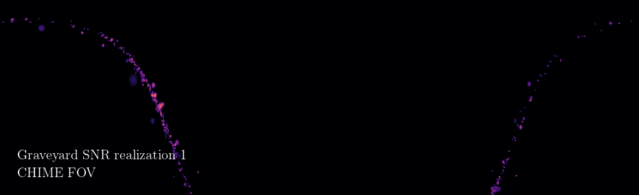

# Axion mirror

## Run status
|       | CHIME | CHORD | HERA  | HIRAX256 | HIRAX1024 | BURSTT256 | BURSTT2048 |
|-------|-------|-------|-------|----------|-----------|-----------|------------|
| egrs  |   Y   |   Y   |   Y   |    Y     |     Y     |     Y     |     Y      |
| gsr   |   Y   |   Y   |   Y   |    Y     |     Y     |     Y     |     Y      |
| snrf  | BETR  | BETR  | BETR  |   BETR   |   BETR    |   BETR    |   BETR     |
| snrp  | BETR  | BETR  | BETR  |   BETR   |   BETR    |   BETR    |   BETR     |
| snrg  | BETR  | BETR  | BETR  |   BETR   |   BETR    |   BETR    |   BETR     |
| reach | BETR  | BETR  | BETR  |   BETR   |   BETR    |   BETR    |   BETR     |

- B: base
- E: ti - time index / electron model
- T: tf - t_free
- R: sr - snr rate